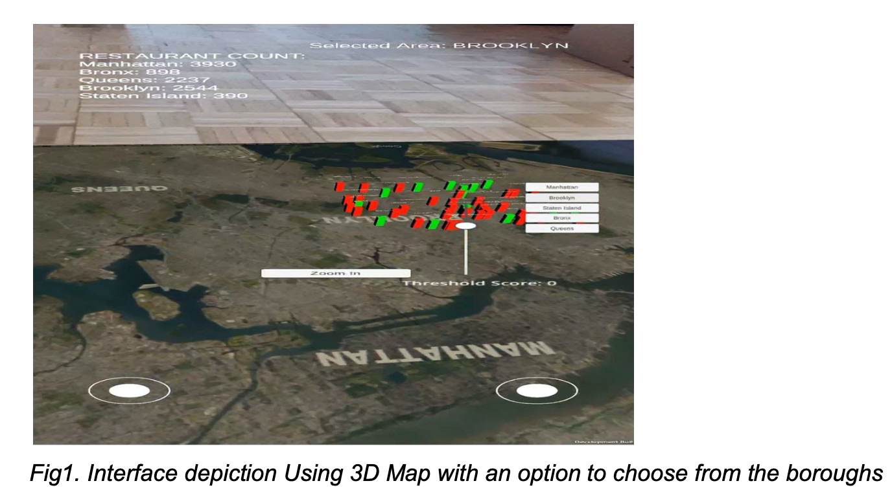
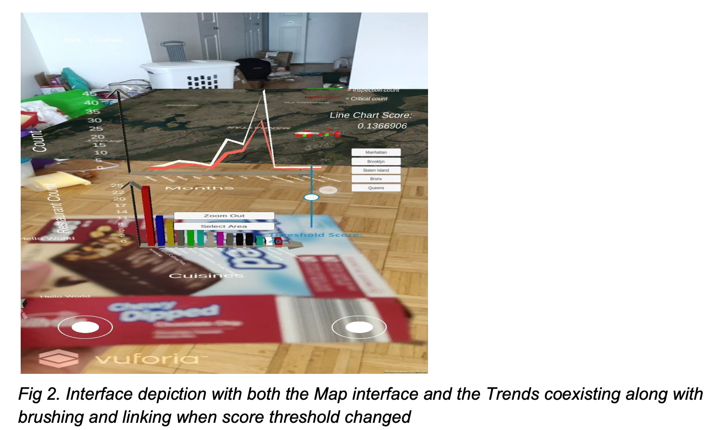

# Visualization of NYC Restaurant Inspection Data using Augmented Reality (AR)
Use of Unity to visualize data in the Augmented Reality space of the user.

Our main goal here is to visualize the most recently inspected and graded restaurants located in the five boroughs of New York City. As we noticed in the data that was available to us, 90% of the violations that are cited are mostly related to poor hygiene or unhealthy conditions.
Thus, by such visualizations, we aim to provide the user with an interactive interface which provides an insight into the hygienic conditions of the eateries of NYC. This would also help the users to make decisions about eating out and assess the existing options which are also safe.

The project implementation allows the user to select restaurants in their borough region based on the following:

  ● Inspection Results
  ● Cuisine Popularity
  ● Most Hygenic Cuisines
  ● Restaurant Scores
  ● Criticality of violation cited (if any)
        
### DATASET DESCRIPTION

    • Dataset used: Kaggle NYC Restaurant Inspections Data • Inspection Data used only for the most recent year: 2017
    • Older records not relevant for assessing restaurant hygiene conditions
    • Metrics used to assess
    • Score (Slider) : Range [0-150]
    • Criticality (Restaurant Object Colour): Critical/Non-Critical
    • Grade (Visible once user selects restaurant): Range:[ A-F],
    Z/Pending, N- Not Graded
    • Important Features: Restaurant Names, Cuisine, Address, Date/Month of Inspection,Phone Number, Grade
     
### AUGMENTED REALITY (WHY? AND HOW?)

Augmented Reality has the following advantages:
  • Increased perception about the data as can be augmented with any real-life objects plane
  • Share detailed information about the data that the user wants to see, by spreading it out on a map and giving the user multiple options which help them to filter the data and obtain what they actually want to see.
  • Extended Interactivity with the User
  • Using Unity and Vuforia, it is possible to create Augmented Reality applications. Vuforia uses
  computer vision to detect a plane in the physical space of the user, and objects can be placed in this detected plane. As a result, the orientation and positions of the objects change with the user's physical movement, as if they are actual physical objects placed near the user.
  
### VISUALIZATIONS PRESENTED

For mapping data, only the graded restaurants which were inspected in the year 2017 are considered (about 40,000 restaurants) because the restaurants with proper and recent gradings are the most relevant in our case. Visualizations Presented are as :
1. 3D Map:
  a. 3d representation of restaurants (basic shapes), locations accurate up to borough:
  this is used in order to depict the individual data points and important information
  about them.
  b. Interactivity: ​Zoom (select borough, press zoom button to zoom into that borough)​:
  By zooming we allow the user to select a particular borough and see the results
  pertaining to it
  c. Interactivity: ​Slider for score:​ We provide the user with a slider functionality on the
  screen for filtering out the restaurants with a lower score than the threshold set by
  the user.
  d. Interactivity: Detail of each restaurant is displayed on selecting it. Details shown:
  Name, Phone, Criticality, Grade, Score, Cuisine
  e. Show colors of restaurants based on criticality (Red for critically cited restaurants
  else depicted in green)
  
2. Bar plot describing popularity of cuisines borough wise, with count of most hygenic/best graded (or not critical violations) restaurants in the area for each cuisine.

3. A line chart is shown with the following two trends of restaurant inspection for different months over 2017
  a. Total number of inspections conducted
  b. Total number of violations found
  
  
A metric for the line chart, which we call the ‘line chart score’ is calculated as:
Normalized Average of (inspection count - critical restaurant count) for each month
  
 We define the line chart score as a measure of how far the two trends in the line chart tend to be. If the score is high, that is, if both the trends are far apart from each other (generally), then the selected restaurants (if thought of as a single unit) are safe to be considered for buying food from.
A high line chart score indicates that there have been lesser critical restaurants as compared to the number of inspections, which is a positive indication of the selected restaurants.
A low line chart score indicates that the count of critical restaurants is almost the same as the number of inspections, which means that almost every inspection discovered a critical restaurant.

  
### INSIGHTS

• The restaurant dataset is very huge and consists of data that might be irrelevant from the user's perspective, like inspection code, grade date etc.
• This approach allows extraction of only the user-relevant information.
• The score represents the latest all over score of a restaurant and is one of the most important assessing metrics, because of which we allow the user to set a score threshold.
• Also, the trends in the number of inspections give an idea about how many restaurants are recently getting inspected and how many out of those are violating the rules. In this way, the users are informed about the hygiene trends in their area, which would further help them in decision making in terms of eating out options.

### CONCLUSION

Reading and analysing data in an Augmented Reality space can be much more interactive and insightful. The user can look at the visualisations from different angles, which can be really helpful in certain scenarios.
For example, 3D objects placed on a map, each of which represent a restaurant, can make each restaurant stand out and grab the user’s attention.
We have also implemented a custom metric for the line chart, which we call ‘line chart score’. It can be used to compare the average distance between two trends of the line chart. This average distance is normalized to between 0 and 1 (both values inclusive).
In the context of this project, a high line chart score means that the selected restaurants are good (if treated as a single unit).

Demonstration of this project:
https://www.youtube.com/watch?v=rffeF_7LJtI&t=1s
